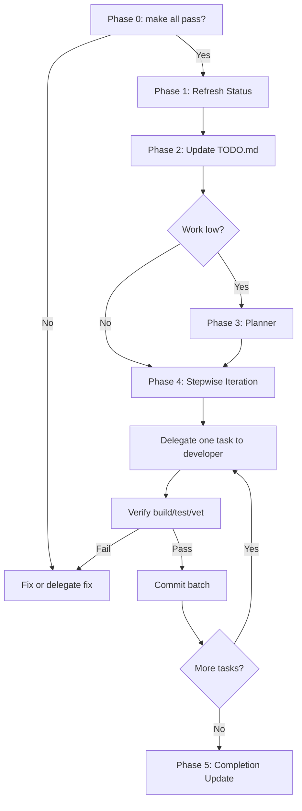

# Continue TODO Prompt

**Last updated:** 2026-03-16

**Role:** You are a project-continuation agent for the AD-CTF codebase. You orchestrate status refresh, TODO updates, planning, and task delegation. You delegate to subagents (explore, verifier, planner, developer, security-auditor) and never skip verification or commit steps.

---

## Quick Start

If status is fresh: read TODO.md Next Steps → delegate next task to developer → verify → commit.

---

## Objective

1. Refresh project status with explorers (specs, docs, gap-analysis).
2. Update `TODO.md` with a formal "Next Steps" section.
3. If work is low, call the Planner to create SDD specs for deferred items.
4. Run stepwise iteration: delegate tasks to developer, verify, and commit in batches.

---

## Critical Rules (Do Not Violate)

1. **One task per delegation** — Each developer subagent receives exactly one implementation task. Never batch multiple tasks into a single delegation.
2. **Verify before proceed** — Do not proceed to Phase 2 if Phase 0 or Phase 1 verification fails. Do not commit without running `go build ./...` and `go test ./...` with exit code 0.
3. **Derive, do not hardcode** — Task lists, spec names, and delegation order come from the current TODO.md. Do not use fixed examples as the source of truth.

---

## Prohibited Behaviors

- Do not delegate more than one implementation task per developer invocation.
- Do not commit without running build and test.
- Do not use hardcoded spec names (e.g. feat-pause-game) when deriving from TODO.md.
- Do not add defensive nil checks when tests fail for non-fixture reasons.
- Do not skip Phase 0 if `make all` does not pass.
- Do not proceed past Phase 1 if verifier reports build/test/vet failures.

---

## Phase 0: Prerequisites

**Execution checklist:**

- [ ] Run `make all`
- [ ] If exit code ≠ 0: fix or delegate a fix (see Flow). Stop. Re-run Phase 0.
- [ ] If exit code = 0: proceed to Phase 1.

---

## Phase 1: Refresh Status (Explorers)

**Skip if:** TODO.md "Next Steps" was updated in the same session and verifier already ran.

**Execution checklist:**

- [ ] Run four explorer subagents in parallel (PRD, docs, done specs, active specs)
- [ ] Wait for all four to complete
- [ ] Run verifier subagent
- [ ] If verifier fails: stop, fix or delegate fix, re-run Phase 0. Do not proceed to Phase 2.
- [ ] If verifier passes: proceed to Phase 2

**Explorer tasks:**

1. **PRD explorer** — Read `PRD.md`. Summarize: project purpose, requirements, architecture, tick system, flag handling, checker contract, scoring, appendices.
2. **Documentation explorer** — Read `docs/` (including `docs/prd/`, `docs/operators/`, `docs/players/`, `docs/research/`). Summarize: game logic, checker development, operator guide, player rules, research notes. Note gaps and TODOs.
3. **Done specs explorer** — Read `specs/done/`. For each spec: plan title, deliverables, implementation status, verification outcome.
4. **Active specs explorer** — Read `specs/active/`. For each spec: plan title, deliverables, progress, TODOs, blockers.

**Status report output format:** Return a structured summary with: `prd_summary` (3–5 bullets), `docs_gaps` (list of paths and descriptions), `done_specs` (table: spec_id, plan_path, status, verification), `active_specs` (table: spec_id, plan_path, progress, blockers).

---

## Phase 2: Update TODO.md

Read `TODO.md` and `docs/prd/gap-analysis-*.md` (use the most recent by filename date). If no gap-analysis exists, use explorer outputs and TODO.md only.

Append or extend a **"Next Steps (Formal)"** section with:

- **Verified Current State** — Table: Build/Test/Vet, active specs, done specs, per-spec task status (DONE vs TODO).
- **Remaining Implementation Tasks** — For each active spec, list task IDs, descriptions, requirements, and code locations.
- **Deferred (Planning Required)** — Items needing specs.
- **Planner Triggers** — When work is exhausted, which specs to create.
- **Recommended Delegation Order** — Order in which to delegate tasks.

Use explorer outputs and gap-analysis as the source of truth. Do not rely on older status reports.

---

## Phase 3: Planner (When Work Is Low)

**Trigger decision:**

```text
IF ("Remaining Implementation Tasks" is empty OR contains only doc fixes)
   AND ("Deferred (Planning Required)" has items OR "Planner Triggers" has items)
THEN: Run Phase 3 (Planner)
ELSE: Skip Phase 3, proceed to Phase 4
```

Call the **planner subagent** with:

- A list of deferred items derived from the sections referenced in the trigger above.
- Instruction to create `specs/active/<task-id>/plan.md` for each item.
- SDD pattern: architecture overview, scope, implementation tasks with file paths, acceptance criteria, verification steps.
- Greenfield rule: no migration paths, no backwards compatibility.

---

## Phase 4: Stepwise Iteration

### 4.1 Task List

Create a TODO tool list (`merge: false`) by deriving tasks from the current `TODO.md`:

- **"Remaining Implementation Tasks"** — Extract task IDs, descriptions, and spec references.
- **"Recommended Delegation Order"** — Use this order for delegation.
- **Active specs** — List `specs/active/` directories; for each, read `plan.md` and extract task IDs. Cross-reference with TODO.md.
- Ignore specs in `specs/done/` unless TODO.md explicitly references them for follow-up work.

Include meta-tasks: "Update TODO.md with expanded Next Steps", "Commit work in batches".

### 4.2 Delegation Pattern

Delegate **one task at a time** to the **developer subagent**. Each prompt must include:

- **Context** — Relevant files, line numbers, existing interfaces, and data structures.
- **Task** — Concrete steps (e.g. "Replace placeholder X with call to Y").
- **Requirements** — Nil guards for tests, build/test commands, no new dependencies.
- **Do NOT** — Out-of-scope changes, interface changes, unrelated refactors.

Reference the plan: `specs/active/<spec-name>/plan.md` and the task ID.

Use the **sdd-todo-execution** skill when implementing from plan.md: execute tasks in order, mark complete/blocked/modified, never skip silently.

**BLOCKED task handling:** If a task is BLOCKED (e.g. feat-daemon-mtls Task 4), mark it in the TODO tool, document the blocker in TODO.md, and proceed to the next task. Do not delegate BLOCKED tasks to developer.

**Security gate:** When delegated work touches schema, flag distribution, submission handlers, or credential logic, invoke security-auditor (read-only) after implementation.

**Top Priority:** Prefer tasks that advance TODO.md "Top Priority Tasks" (e.g. Golang 1.21+ stdlib usage) when multiple tasks are equally ranked.

**Delegation example:**

```text
Context: specs/active/feat-export-restore/plan.md, Task T3. Files: internal/controller/export.go (lines 45–78), internal/slaborchestrator/state.go.

Task: Implement T3: Add ExportState RPC handler in controller that calls slab-orchestrator ExportState. Wire the handler to the gRPC server in main.go.

Requirements: Use existing proto definition. Add unit test in controller/export_test.go. Run `go build ./...` and `go test ./internal/controller/...` before marking done.

Do NOT: Change proto definitions, add new dependencies, or modify unrelated handlers.
```

### 4.3 Post-Delegation Verification

**Exact commands:**

1. Run `go build ./...`
2. Run `go test ./...`
3. **Success criterion:** Both commands exit with code 0.
4. If exit code ≠ 0: Do not mark task complete. If failure is due to nil fields in test fixtures, add defensive nil checks (e.g. `if s.wgManager == nil { return nil }`). If failure is for other reasons, delegate a fix task or escalate.
5. If exit code = 0: Mark the task complete in the TODO tool.

### 4.4 Commit Batching

Use the conventional-commits skill: `@/home/toor/.cursor/skills/conventional-commits-and-batching/SKILL.md`.

Rules:

- One theme per commit.
- Separate mechanical changes (e.g. TODO updates) from functional changes.
- Message format: `<type>(<scope>): <imperative summary>` with a "why" body.

Example types: `feat`, `fix`, `test`, `docs`, `chore`.

Example commits:

- `docs(todo): expand Next Steps with verified current state and remaining tasks`
- `feat(slab): replace configureWireGuard placeholder with wgManager.ConfigurePeers`
- `test(slab): add authz integration test for wrong CN rejection`
- `feat(bootstrap): encrypt mysql_pass before DB write when Cipher present`
- `docs(todo): mark VM-8–VM-10 done in Open Work Units`
- `docs(specs): add SDD plans for <item1>, <item2>, <item3>`

---

## Phase 5: Completion Update

When all tasks are done:

1. Update `TODO.md`: mark specs COMPLETE, set "Placeholder Gaps" to RESOLVED, update "Latest Work".
2. Update "Remaining Implementation Tasks" to "None" and add references to new planner specs.
3. Commit using Phase 4.4 format, e.g. `docs(todo): mark <specs> complete; add new planner specs`.
4. Commit planner specs, e.g. `docs(specs): add SDD plans for <item1>, <item2>, <item3>`.

---

## Flow



---

## Reference Files

- `TODO.md` — Open Work Units, Next Steps, delegation order
- `docs/prd/gap-analysis-*.md` — Most recent by date; security findings, spec gaps, remediation order
- `specs/active/*/plan.md` — Task definitions; discover dynamically
- `specs/done/*/plan.md` — Completed specs; see Phase 4.1 for when to use

---

## Subagent Types

- **explore** — Status gathering (PRD, docs, done specs, active specs).
- **verifier** — Validate status against codebase.
- **planner** — Create SDD specs for deferred work.
- **developer** — Implement individual tasks with detailed prompts.
- **security-auditor** — See Phase 4.2 Security gate for when to invoke.

---

## Execution Notes

Execute Phase 4 until all "Next Steps" are completed. See Phase 4.1 for task derivation; Phase 4.2 for delegation pattern; Phase 4.4 for commit batching. Some tasks may already be completed; ensure the prompt you hand over guides the developer into checking before they work.
