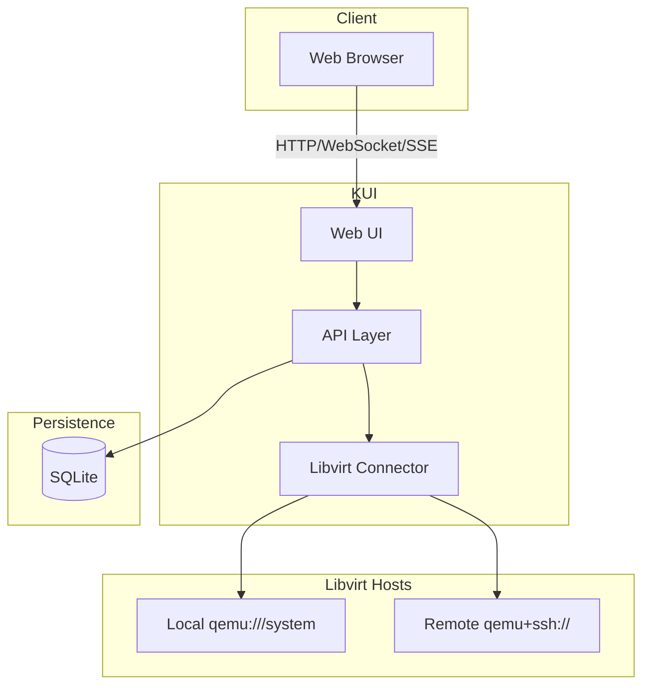

# KUI Architecture

System diagrams and architecture requirements. Decisions: [decision-log.md](decision-log.md). Stack: [stack.md](stack.md).

---

## §1 System Overview



---

## §2 Component Boundaries

| Component | Responsibility | Out of scope |
|-----------|----------------|--------------|
| Web UI | VM list (Winbox.js Canvas), lifecycle actions, console proxy, host selector | Storage/network management |
| API | REST/JSON, auth, audit, session | Direct libvirt XML |
| Libvirt Connector | Connection management, URI resolution, domain/network/storage queries | VM provisioning logic |
| SQLite | Users, audit, preferences, template metadata | VM disk images |

---

## §3 Data Flow

```mermaid
sequenceDiagram
    participant U as User
    participant B as Browser
    participant K as KUI API
    participant L as Libvirt
    participant D as SQLite

    U->>B: Select host, create VM
    B->>K: POST /api/vms (host_id, pool, disk; MVP pool+path)
    K->>D: Audit log
    K->>L: Connect(URI)
    K->>L: DefineDomain(xml)
    K->>L: CreateDomain()
    K->>D: Audit log
    K->>B: 201 Created
    B->>U: VM listed
```

---

## §4 Deployment Topology

- **Local**: KUI and libvirt on same host. Default URI `qemu:///system`.
- **Remote**: KUI on separate host; connects to libvirt via `qemu+ssh://user@host/system?keyfile=...`. Host list from config (default /etc/kui/config.yaml; see [decision-log.md](decision-log.md) §2).
- **Prerequisites**: Remote host needs `libvirtd` and `nc` (netcat). Auth delegated to SSH.
