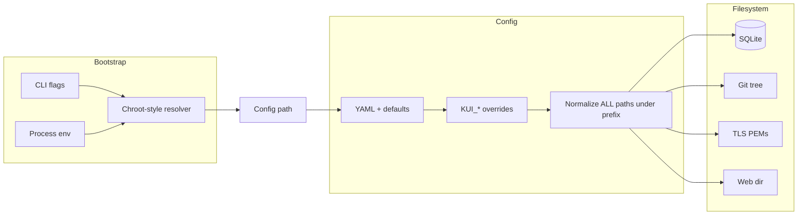

# feat-runtime-prefix Plan

## Overview

Introduce a single **runtime prefix** (`--prefix` / `KUI_PREFIX`, optional YAML) so operators can run KUI from a relocatable install tree. **When prefix is non-empty, it behaves like a chroot root for filesystem access** (analogy only—not `chroot(2)`): both **relative and absolute** path strings that KUI resolves to local files are **re-rooted under** `prefix` (e.g. `/var/lib/kui/images` → `{prefix}/var/lib/kui/images`). That lets **non-root** users and **tests** use a single directory (e.g. `t.TempDir()`) without touching real `/etc`, `/var`, or system libvirt directories unless they choose to mirror that layout under `prefix`.

**Greenfield:** target behavior for fresh installs only; no migration, backfill, or compatibility modes.

### Feature brief (input)

Operator-facing: prefix **changes the effective root** for paths the app opens locally (config, data, git, TLS, web dir override, provision pool **directory** defaults, test overrides). Simplifies testing by making “absolute” config paths harmless—they land under the temp prefix.

### Spec

See [`spec.md`](./spec.md) for acceptance criteria and non-goals.

### Assumptions

- Prefix applies only to **paths KUI opens as local files/directories** for its own config, data, static assets, and TLS material—not to libvirt URIs, network addresses, or arbitrary strings (e.g. `template_storage` remains a **pool name**, not a filesystem path).
- **Host-level probes** (`/dev/kvm`, `/etc/os-release` in `internal/kvmcheck`) stay **fixed**; they describe the machine, not the install prefix.
- Embedded `web/dist` needs no disk cache when `KUI_WEB_DIR` is unset; prefix does not invent a disk path for embedded assets. If `KUI_WEB_DIR` **is** set, it is normalized like any other path (absolute → under prefix).
- SQLite may create `-wal` / `-shm` sidecars next to the DB file; resolving `db.path` under prefix is sufficient.
- **Production caveat:** With prefix set, **default libvirt pool directory probes** (e.g. `/var/lib/libvirt/images`) resolve under `prefix`. Real libvirt on the host still uses **host** paths unless the operator mirrors layout under `prefix`, uses bind mounts, runs with empty prefix for FHS mode, or configures pools accordingly. Document this explicitly.

### Open questions (minimal)

- Whether optional YAML `runtime.prefix` is worth the complexity vs flag/env only (see Decision log). If implemented, it must be read from the **first** successfully loaded config file only and must not apply retroactively to the path used to find that file.

---

## Tech Stack

- **Frontend**: unchanged (embedded or `KUI_WEB_DIR`)
- **Backend**: Go (`cmd/kui`, `internal/config`, `internal/routes`, `internal/db`, `internal/provision`, …)
- **DB**: SQLite (path string + sidecars in same directory)
- **Deploy**: systemd unit + docs under `deploy/`, `docs/`

---

## Architecture

### Single runtime prefix vs many env vars

**Decision: one canonical `KUI_PREFIX` / `--prefix` (optional YAML mirror),** not a matrix of `KUI_*_PREFIX` variables.

- **Why:** Relocatable installs and tests need one knob; autoconf-style `--prefix` matches operator mental models.
- **Interaction:** Existing `KUI_DB_PATH`, `KUI_GIT_PATH`, `KUI_CONFIG`, `KUI_WEB_DIR`, `KUI_HOST_*_KEYFILE`, etc. still act as **overrides** after YAML defaults. **After** the effective path string is known, **one normalization step** applies the chroot rule whenever prefix is non-empty (no special case for “already absolute”).

### Resolution pipeline (conceptual)

1. **Bootstrap:** Parse CLI (including new `--prefix`). Read `KUI_PREFIX` if flag not set (same “tracked flag vs env” pattern as `--config` / `KUI_CONFIG`).
2. **Config path:** Apply chroot normalization to the **candidate** config path when prefix is set (whether the candidate is relative or absolute). **Built-in defaults** such as `/etc/kui/config.yaml` become `{prefix}/etc/kui/config.yaml` when prefix is non-empty; when prefix is empty, keep today’s string defaults unchanged.
3. **Load YAML:** `config.Load` unchanged in wire format; after `applyDefaults` + `applyEnvOverrides`, run a single **path normalization pass** that applies the chroot rule to **all** configured filesystem paths when prefix is set.
4. **Setup mode** (`main` when no valid config): same rules for `KUI_DB_PATH` / `KUI_GIT_PATH` fallbacks and hardcoded defaults.
5. **TLS:** Resolve `--tls-cert` / `--tls-key` through the same helper before `ServeTLS` (absolute PEM paths → under prefix when prefix set).
6. **Static files:** `resolveWebFS`: if `KUI_WEB_DIR` set, apply chroot normalization when prefix set.
7. **Provision:** Apply the **same** chroot rule to **`DefaultKuiPoolPath`** and **`DefaultPoolPath`** when prefix is set—tests can create `{prefix}/var/lib/libvirt/images` (or override via `KUI_TEST_PROVISION_POOL_PATH`) without root. **`KUI_TEST_PROVISION_POOL_PATH`:** always through the same helper when prefix set (absolute `/foo` → `{prefix}/foo`).

### Diagram



---

## Components

| Component | Responsibility |
|-----------|----------------|
| **`cmd/kui`** | Parse `--prefix`; compute effective config path before stat/load; pass prefix into config load / router; resolve TLS paths; align helper paths with main’s precedence rules. |
| **`internal/config`** | Optional: `runtime.prefix` in YAML; path normalization after env overrides; **fix `LoadWithArgs` precedence** to match `main.parseFlags` (today env `KUI_CONFIG` overrides `--config` unconditionally—undesirable vs main). |
| **New small package (e.g. `internal/prefix` or `internal/fsroot`)** | Pure functions: `Resolve(prefix, p string) string` — if prefix empty, preserve legacy behavior for `p`; if prefix non-empty, `filepath.Join(prefix, stripLeadingSeparators(filepath.Clean(p)))` (document Unix vs Windows: use `filepath` idioms). Unit tests for `..`, cleaning, relative + absolute. Containment helpers / symlink notes in doc comments. |
| **`internal/routes`** | `writeConfigFile` temp path is sibling of config path—automatic once config path is normalized. |
| **`internal/provision`** | Both default pool directory constants go through the same resolver when prefix set; test override env same. |
| **`internal/db`** | No logic change beyond receiving already-resolved path from callers. |
| **`docs/` + `deploy/systemd/`** | Chroot analogy, **contained non-root runbook**, automated vs manual testing pointers, production + libvirt layout caveat. |

---

## Documentation deliverables (contained non-root mode)

Ship user-facing and contributor-facing text so **running with `--prefix` is a first-class, documented path**—not only an implementation detail.

| Doc / artifact | Required content |
|----------------|------------------|
| **`README.md`** | Short subsection or bullet: what `--prefix` / `KUI_PREFIX` does (chroot-style); **one minimal example** (e.g. `export KUI_PREFIX=…` or `--prefix …`, optional `--config /etc/kui/config.yaml` showing logical vs physical path); link to admin guide for full runbook. |
| **`docs/admin-guide.md`** | Dedicated section **“Contained / non-root mode (`--prefix`)”**: create writable prefix tree (`mkdir -p` for `etc/kui`, `var/lib/kui`, and any paths from defaults or your YAML); show **sample config** using absolute-style paths in YAML that resolve under prefix; **precedence** of CLI `--prefix` vs `KUI_PREFIX`; TLS / `KUI_WEB_DIR` under prefix; **when not to use prefix** (host libvirt + real FHS). |
| **`docs/deployment.md`** | Same semantics in deployment terms: relocatable install directory, permissions, optional **systemd** `ExecStart` with `--prefix` and mirrored layout; cross-link admin guide. |
| **`deploy/systemd/README.md`** + **`deploy/systemd/kui.service`** (or equivalent) | At least one **commented or alternate** example using `--prefix` and paths relative to that tree; primary unit may remain FHS for production if desired. |
| **`docs/user-guide.md`** | Update **only if** end-user-visible behavior changes (usually N/A); otherwise no change required. |
| **`Makefile`** | If `make help` or README build instructions exist, add a **one-line** hint that local contained runs use `--prefix` (optional—only if the Makefile already documents run targets). |

**Acceptance (docs):** A new contributor can follow admin guide + README **without root**, create a prefix tree, place config, and run the binary (per their own `go build -o bin/kui ./cmd/kui` or packaged binary) with `--prefix` and see SQLite/git paths created **only** under that tree.

---

## APIs

No HTTP API changes. **Startup contract (operator-facing):**

| Input | Meaning |
|-------|---------|
| `--prefix <dir>` | Virtual filesystem root for all KUI-resolved local paths; explicit flag beats env where applicable. |
| `KUI_PREFIX` | Same as `--prefix` when flag not explicitly provided. |
| Optional YAML `runtime.prefix` | If adopted: applies only after successful parse; **cannot** relocate the path used to load that file unless the file was found via a relative `KUI_CONFIG` / `--config` already combined with prefix in bootstrap. Prefer documenting “set flag/env for bootstrap” if YAML field exists. |

Errors: invalid prefix (empty after trim, or not a directory) → fail fast at startup with a clear message; path escapes (if validation enabled) → fatal with path details.

---

## Data Models

No database schema changes. Optional YAML field only:

```yaml
# optional top-level key; omit for empty prefix
runtime:
  prefix: "/opt/kui"   # example only; see Open questions
```

If YAML key is omitted, behavior is flag/env-only.

---

## Config surface (flag + env + optional YAML)

**Precedence (highest first):** explicit CLI path flags → matching `KUI_*` env when CLI not set → YAML values → compiled defaults.

**Prefix precedence:** `--prefix` if set on CLI vs tracked flag pattern; else `KUI_PREFIX` if non-empty; else YAML `runtime.prefix` if implemented; else empty (current behavior).

**Interaction with existing `KUI_*`:** Env overrides still replace YAML for `db.path`, `git.path`, etc. **After** those merges, when prefix is non-empty, apply **one** chroot normalization to each filesystem path value. Use `filepath.Clean` before stripping leading separators and joining.

**Default paths when prefix is set:** Same rule as YAML/env: e.g. `/var/lib/kui` → `filepath.Join(prefix, "var", "lib", "kui")` (or equivalent single join after leading-`/` strip—avoid passing `"var/lib/kui"` as one Join segment incorrectly on any platform; prefer `filepath.Join(prefix, filepath.FromSlash(strings.TrimPrefix(...)))` pattern documented in code).

---

## Path joining rules (chroot-style)

**Decision: When prefix is non-empty, every normalized local filesystem path is resolved under `prefix`.** There is **no** “absolute paths ignore prefix.”

| Step | Rule |
|------|------|
| 1 | `filepath.Clean(p)` |
| 2 | If **prefix empty** → return `p` unchanged (**legacy**: relative stays CWD-relative behavior in call sites as today; absolute stays absolute). |
| 3 | If **prefix non-empty** → strip leading path separators from the cleaned path, then `filepath.Join(prefix, remainder)`. Relative and absolute inputs both end up under `prefix`. |
| 4 | Reject or document `..` that escapes `prefix` if implementing strict containment checks (optional lexical check after join). |

| Operator / tester impact | |
|--------------------------|---|
| **Prefix set** | All configured paths (including those written as `/etc/...`) open under `{prefix}/etc/...`. Ideal for non-root and `t.TempDir()`. |
| **Prefix empty** | Preserve current behavior (CWD-relative relatives, absolute as-is). |
| **TLS** | PEMs live under the prefix tree when prefix is set (e.g. `{prefix}/etc/kui/tls/...`). |

**Rejected alternative:** Let absolute paths bypass prefix. **Why rejected:** User requirement for chroot-like testing and non-root simplicity; bypasses defeated “change the root” semantics.

**Rejected alternative (for later product):** Optional `host_absolute_paths: true` escape hatch — **out of scope** unless requested; empty prefix covers “true FHS + system TLS” deployments.

---

## Interaction with systemd examples

Update `deploy/systemd/kui.service` and `deploy/systemd/README.md` (and `docs/deployment.md`, `docs/admin-guide.md`) per **Documentation deliverables** above. In particular:

- **Test / relocatable example:** `ExecStart=.../kui --prefix /tmp/kui-run --config /etc/kui/config.yaml` resolves config to `/tmp/kui-run/etc/kui/config.yaml`.
- **Production:** Either **empty prefix** + real FHS paths for system libvirt integration, **or** a prefix tree that mirrors needed paths (including pool directories) with correct permissions.
- `WorkingDirectory=` is independent of prefix; document consistency with effective `git.path` / `db.path` for tooling.

---

## Security

| Risk | Mitigation |
|------|------------|
| **Symlink / traversal escape** | After join, optionally `filepath.EvalSymlinks` on prefix at startup (once) and verify resolved paths for operations are **lexically** under resolved prefix (`strings.HasPrefix` + separator check). With chroot semantics, **all** normalized app paths participate—no bypass class. |
| **World-writable prefix** | Document: dedicated user, `chmod`/`chown`; tests use `t.TempDir()` per user. |
| **Misleading absolute paths in config** | Document clearly: leading `/` does **not** mean “host root” when prefix is set. |

---

## Performance

One-time prefix resolution at startup; negligible vs network/libvirt work.

---

## Risks

| Risk | Impact | Mitigation |
|------|--------|------------|
| Operator expects `/var/...` to mean host while using `--prefix` | Wrong pool / missing dirs | **Admin guide** + decision log; recommend empty prefix for “pure host FHS” |
| `LoadWithArgs` / test drift | Tests don’t match production | Unify precedence with `main`; add tests for prefix + absolute YAML paths |
| Double-applying prefix | Broken paths | Single normalization function; unit tests for ordering (env after YAML, prefix last) |
| libvirt pool path vs host reality | Create disks under prefix tree while libvirt expects host path | Document; separate from XML disk paths—operational alignment is operator responsibility |

---

## Testing

### Automated (required)

These are the **canonical** verification path; they must run in CI via `go test` / `make all` and must not depend on executing `./bin/kui` from automation unless the repo already has such a pattern.

- **Unit:** `internal/prefix` (or equivalent): empty prefix no-op legacy behavior; non-empty prefix with **absolute** and **relative** inputs; `..` segments; Clean; representative Unix paths.
- **`internal/config`:** Load from `t.TempDir()` as prefix with YAML **`/var/lib/kui/db.sqlite`-style** absolute paths—assert opens under prefix.
- **`cmd/kui`:** Integration-style tests: prefix + absolute `KUI_*` paths resolve under prefix without touching system dirs (prefer `run(args, …)` / `parseFlags` / `buildApplication` **seams** already used in package tests).
- **Provision:** With prefix, `DefaultPoolPath` and `DefaultKuiPoolPath` both resolve under prefix; `KUI_TEST_PROVISION_POOL_PATH` absolute → under prefix.
- **Regression:** Embedded web when `KUI_WEB_DIR` unset; when set with absolute path + prefix, under prefix.

**Verification (implementer):** run `make all` once at completion (`go build`, tests, vet per Makefile).

### Contained mode: documented manual path (supplementary)

For **humans** validating end-to-end behavior after a local build, **document** in `docs/admin-guide.md` (and pointer in `README.md`) a short checklist:

1. `export PREFIX=$(mktemp -d)` (or a fixed dir under `$HOME`).
2. `mkdir -p` every directory implied by defaults or your config (e.g. `$PREFIX/etc/kui`, `$PREFIX/var/lib/kui`, pool dirs if exercising provision defaults).
3. Install or generate minimal `config.yaml` using **absolute-style paths** in YAML; confirm on disk they appear only under `$PREFIX/...`.
4. Run: `kui --prefix "$PREFIX" …` (and/or `KUI_PREFIX="$PREFIX"`). Note **libvirt** may still require host access—manual smoke may be “starts and binds HTTP / opens DB” without full VM create.

This path **does not replace** automated tests; it aligns with contributor expectations and **non-root** local runs.

---

## Rollout / ops

- Document required **mirror layout** under prefix when mimicking FHS (`etc/kui`, `var/lib/kui`, `var/lib/libvirt/images` for defaults, etc.).
- No migration: new installs set `--prefix` or rely on empty prefix + legacy FHS behavior.

---

## Ownership boundaries

### In scope (expected to change)

- `cmd/kui/main.go` (and tests if present)
- `internal/config/config.go`, `internal/config/config_test.go` (`LoadWithArgs` alignment)
- New package under `internal/` for prefix resolution (name TBD)
- `internal/routes/routes.go` only if `resolveWebFS` or config write paths need explicit resolution hooks (may be none if env resolved in main)
- `internal/provision/provision.go` (+ tests)
- **`README.md`**, `docs/deployment.md`, `docs/admin-guide.md`, `deploy/systemd/*` (per **Documentation deliverables**)

### Out of scope (must not change behavior without new spec)

- libvirt URI schemes, authentication, JWT/session semantics
- `internal/kvmcheck` default host paths (remain true host paths)
- Database schema / migrations
- Frontend build pipeline (except docs mentioning `KUI_WEB_DIR`)
- Rewriting paths inside domain XML on disk

---

## Decision log

1. **Single prefix vs multiple env vars** — Chose single `KUI_PREFIX` / `--prefix`. *Alternatives:* per-subsystem prefix envs. *Why:* one operator/test knob. *Risk:* rare split layouts—*mitigation:* empty prefix restores host-absolute semantics.

2. **Absolute paths: chroot vs ignore prefix** — Chose **chroot-style: prefix applies to absolute paths too** when prefix is non-empty. *Alternatives:* ignore prefix for absolutes (old plan); reject absolutes when prefix set. *Why:* non-root testing and literal “change the root” semantics. *Risk:* production confusion if operators assume `/var/...` is host—*mitigation:* documentation; empty prefix for traditional FHS + system libvirt.

3. **Relative path semantics with prefix** — When prefix non-empty, **prefix-relative** (not CWD-relative) after normalization join. *Why:* relocatable installs must not depend on systemd `WorkingDirectory` for YAML relatives.

4. **YAML `runtime.prefix`** — *Optional*; default recommendation is **flag/env only** to avoid bootstrap confusion. If implemented, lowest precedence among prefix sources after flag/env.

5. **`LoadWithArgs` vs `main` for `KUI_CONFIG`** — Align so `--config` wins over `KUI_CONFIG` when the flag is explicitly set (match `parseFlags`). *Risk:* test churn—*mitigation:* update tests in same change set.

6. **Provision pool defaults** — **Both** `DefaultKuiPoolPath` and `DefaultPoolPath` go through the same chroot resolver when prefix is set, so tests can lay out a full fake tree under `t.TempDir()`. *Risk:* mismatch with host libvirt if operator uses prefix without mirroring—*mitigation:* docs; empty prefix for host-aligned installs.

7. **Documentation + testing story** — **Docs:** README + admin + deployment + systemd examples document **contained non-root** `--prefix` usage. **Tests:** automated tests are canonical; manual checklist in admin guide for human smoke after `go build` (no substitute for `go test`).

---

## Changelog

- _2026-03-19_: Initial plan (no `spec.md`; brief + codebase explore report as input).
- _2026-03-19_: **BREAKING (spec):** Chroot-style semantics—prefix applies to **absolute** paths too; both provision defaults normalized; rejected “absolute bypasses prefix”; added [`spec.md`](./spec.md).
- _2026-03-19_: **Docs + testing:** Added documentation deliverables (README, admin, deployment, systemd); split **automated** vs **documented manual** contained-mode testing path; extended [`spec.md`](./spec.md) acceptance criteria.

---

## Approval checklist

- [ ] Scope matches intent (no extra features)
- [ ] File paths and ownership are clear
- [ ] Data model is correct and safe (greenfield: no migration/backfill)
- [ ] Authn/authz + context scoping are correct (N/A—no auth changes)
- [ ] API contracts are specified (requests/responses/errors) — N/A HTTP; startup contract documented above
- [ ] Test plan + verification steps are included (**automated** + **documented manual** contained mode)
- [ ] Rollout/ops notes are sufficient
- [ ] **Documentation deliverables** (README, admin-guide, deployment, systemd) satisfied for `--prefix` / `KUI_PREFIX`

---

Status: **planning** | Task: `feat-runtime-prefix`
