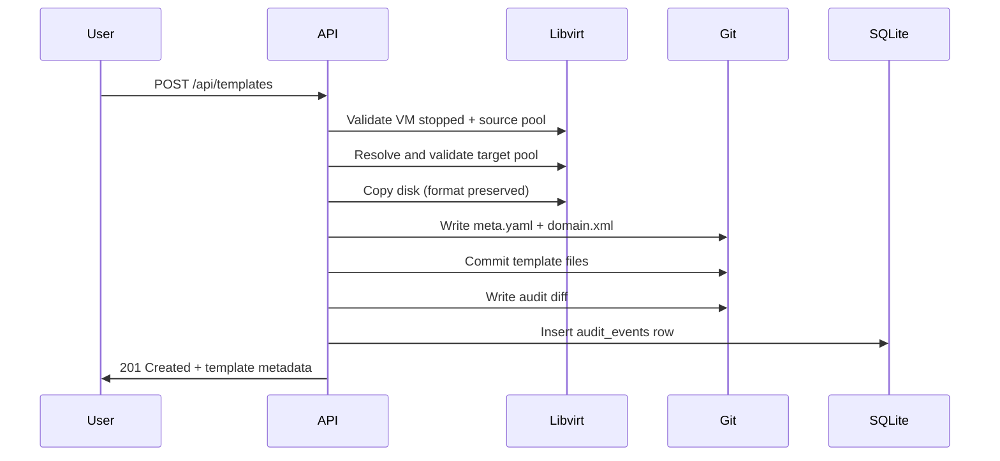

# Spec: Template Management

## 1. What & Why

### 1.1 Problem
KUI has no implementation-level template lifecycle contract, despite template storage being declared in global architecture and schema docs. Operators can create/clone VMs but cannot persist a reproducible VM-to-template conversion flow with the same audit and storage guarantees as other entities.

### 1.2 Users
- Primary operator: single admin running 1–2 concurrent users, managing a few VM workloads.
- Developer/operator implementing MVP template persistence and API endpoints from greenfield codebase.

### 1.3 Value
- Adds a canonical, auditable workflow to convert an existing VM into a template.
- Keeps Git as source of truth for template blueprint files while avoiding disk image commits.
- Ensures template operations behave predictably via explicit pool resolution and base-image validation.

The spec references [docs/prd/decision-log.md](../../docs/prd/decision-log.md), [docs/prd/architecture.md](../../docs/prd/architecture.md), and [specs/done/schema-storage/spec.md](../../done/schema-storage/spec.md).

## 2. Save-VM-as-Template Flow

### 2.1 Input contract
- `source_host_id` (required)
- `source_libvirt_uuid` (required)
- `name` (required): human-readable template name, also the template identifier seed
- `target_pool` (optional): overrides config and source-pool fallback

### 2.2 Pool resolution order
When resolving destination storage for the copied disk:

1. Use request `target_pool` if provided.
2. Else use config `template_storage`.
3. Else use the source VM’s current storage pool.

### 2.3 Preconditions
1. Source VM exists on `source_host_id` and is currently **stopped**.
2. Source VM disk format is readable for copy/clone.
3. Resolved destination pool exists and is active in libvirt.
4. Source VM has at least one source disk that can be copied.

### 2.4 Detailed flow
1. Validate source VM existence and state.
2. Resolve destination pool using §2.2.
3. Validate destination pool exists and is active (same libvirt validation pattern used by clone).
4. Resolve template identity:
   - Compute `template_id` by slugifying request `name`.
   - Reject if `template_id` directory already exists in Git for non-idempotent POST.
5. Copy disk:
   - Copy source disk into resolved destination pool.
   - Preserve source disk format.
   - Use MVP disk naming `source_domain_name` (no suffix/versioning in filename).
6. Build template domain XML:
   - Remove/replace template-specific identifiers (at minimum UUID and source name).
   - Update disk source path to copied disk.
   - Preserve/normalize CPU, RAM, network from VM defaults + source if present.
7. Build `meta.yaml` with required fields.
8. Write template files into Git:
   - `<git_base>/templates/<template_id>/meta.yaml`
   - `<git_base>/templates/<template_id>/domain.xml`
9. Commit template files as the template creation commit.
10. Write template audit diff file:
   - `<git_base>/audit/template/<template_id>/<timestamp>.diff`
11. Record `audit_events` row:
   - `event_type`: `template_create`
   - `entity_type`: `template`
   - `entity_id`: `<template_id>`
   - `git_commit`: template-audit commit SHA

### 2.5 Domain XML sanitization rules
- Remove or replace `uuid` fields.
- Replace `name` with stable placeholder form (or omit if schema allows).
- Ensure exactly one disk source points to the copied volume/path.
- Preserve only values required to recreate a VM-like blueprint.

### 2.6 Sequence (high level)


## 3. List Templates Flow

### 3.1 Source of truth
- Read templates from Git only under `<git_base>/templates/`.
- No dedicated `templates` table for listing.

### 3.2 Execution
1. Enumerate template directories under `<git_base>/templates/`.
2. For each `<template_id>`:
   - Parse `meta.yaml`.
   - Load `domain.xml` if needed for additional response fields.
   - Derive `created_at` from git commit metadata (or directory metadata if unavailable and log ordering available).
3. Return a deterministic ordered list (created descending by default).

### 3.3 Return schema
Each list item includes:
- `template_id`
- `name`
- `base_image`
- `cpu`
- `ram_mb`
- `network`
- `created_at`
- optional `base_image_valid` (true/false if checked)

### 3.4 Error handling
- Per template parse error (e.g. malformed `meta.yaml` or missing `domain.xml`) must not fail the entire list call.
- Invalid entries are either:
  - filtered out with an optional warning channel, or
  - returned with an explicit `invalid` marker and nullable fields.
- Successful processing of other templates continues.

### 3.5 Optional validation mode
- If configured or requested, validate `base_image` for each template:
  - pool exists + active
  - referenced path/volume exists
- If disabled, list returns fast without checking each object’s base image.

## 4. Template Structure

### 4.1 Directory layout (canonical)
From [schema-storage](../../done/schema-storage/spec.md) and decision-log requirement:

```text
<git_base>/templates/
└── <template_id>/
    ├── meta.yaml
    └── domain.xml

<git_base>/audit/template/
└── <template_id>/
    └── <timestamp>.diff
```

### 4.2 `meta.yaml` schema (DDL-like contract)

```yaml
name: <string>              # required
base_image:
  pool: <string>           # required
  path: <string>?          # required if not using volume
  volume: <string>?        # required if not using path
cpu: <int>                 # optional, default from config vm_defaults.cpu
ram_mb: <int>              # optional, default from config vm_defaults.ram_mb
network: <string>          # optional, default from config vm_defaults.network
```

#### Required base_image constraints
- Exactly one of `base_image.path` or `base_image.volume` is required.
- `base_image.path`: absolute path to an existing file in the resolved pool.
- `base_image.volume`: existing volume name in the resolved pool.

### 4.3 Validation behavior
- Validate pool and activity:
  - lookup pool via libvirt
  - verify active state
- Validate base image reference:
  - if `path` used: verify path resolves via path lookup in pool
  - if `volume` used: verify volume exists by name in pool

### 4.4 Domain XML contract
- Must be a libvirt domain XML document.
- Must reference `base_image` through the copied disk path or volume alias.
- Must have VM-specific fields removed/replaced (UUID/name placeholders only).

## 5. API Surface

### 5.1 Endpoints
| Method | Path | Purpose |
|--------|------|---------|
| POST | /api/templates | Save VM as template |
| GET | /api/templates | List templates |

### 5.2 POST /api/templates
**Request body**
- `source_host_id` (string, required)
- `source_libvirt_uuid` (string, required)
- `name` (string, required)
- `target_pool` (string, optional)

**Success response (201)**
```json
{
  "template_id": "ubuntu-2204-base",
  "name": "Ubuntu 22.04 Base",
  "base_image": {
    "pool": "default",
    "volume": "ubuntu-2204-base.qcow2"
  },
  "created_at": "2026-03-16T12:34:56Z"
}
```

**Failure response behavior**
- 400: request validation / malformed payload / empty source name
- 409: duplicate `template_id` for requested name
- 404: source VM not found
- 409/422: source VM not stopped or cannot be copied
- 503: target pool unresolved or inactive

### 5.3 GET /api/templates
**Success response (200)**
```json
[
  {
    "template_id": "ubuntu-2204-base",
    "name": "Ubuntu 22.04 Base",
    "base_image": {
      "pool": "default",
      "path": "/var/lib/libvirt/images/base.qcow2"
    },
    "cpu": 2,
    "ram_mb": 2048,
    "network": "default",
    "created_at": "2026-03-15T10:00:00Z",
    "base_image_valid": true
  }
]
```

### 5.4 MVP out of scope
- `GET /templates/{template_id}`
- `DELETE /templates/{template_id}`
- `PUT /templates/{template_id}`
- VM creation-from-template endpoint

## 6. Requirements

### 6.1 Must
1. Implement save-as-template flow that copies source VM disk, builds template domain XML, writes `meta.yaml`, commits to Git, and emits audit diff + `audit_events`.
2. Implement list flow that reads from Git directories under `<git_base>/templates`.
3. Enforce `meta.yaml` required fields (`name`, `base_image`) and apply defaults for `cpu`, `ram_mb`, `network`.
4. Validate base image pool/path/volume using libvirt primitives.
5. Expose POST/GET `/api/templates` with request/response contracts in §5.

### 6.2 Should
1. Add explicit `base_image_valid` behavior and document when validation is lazy vs eager.
2. Include `template_id` stability checks (slug collision, character normalization, deterministic generation).
3. Include per-template parse error strategy and telemetry-friendly response.

## 7. User Stories & Acceptance Criteria

- As an operator, I can save a stopped VM as a template so I can reuse its configuration.
  - AC: POST `/api/templates` returns `201` with a non-empty `template_id` and creates Git files under `<git_base>/templates/<template_id>/`.
- As an operator, I can list all saved templates and see machine-readable base image, CPU, RAM, and network defaults.
  - AC: GET `/api/templates` returns one list item per valid template directory and does not fail globally due to one malformed template.
- As a developer, I can reason about migration-free behavior by reading this spec and implement it directly.
  - AC: all template storage and API behavior is defined in terms of Git + libvirt lookups without backward-compatible branches.

## 8. Success Metrics
- 100% of successful saves result in: new Git template directory, template audit diff file, and `audit_events` row with `entity_type = "template"`.
- Template listing returns all valid directories, excluding only genuinely malformed entries without aborting whole call.
- Save flow completes with source VM stopped + valid target pool in bounded time envelope and preserves disk format.
- Base image validator rejects unresolved pool/volume/path with stable error class and status.

## 9. Dependencies
- `docs/prd/decision-log.md`
- `docs/prd/architecture.md`
- `specs/done/schema-storage/spec.md`

## 10. Out of Scope
- VM creation from template (v2).
- RBAC-aware template sharing rules (requires role model extension).
- Migration, compatibility modes, or backfill paths (greenfield only).
- Storage/network management and template sharing workflows outside template creation/listing.
